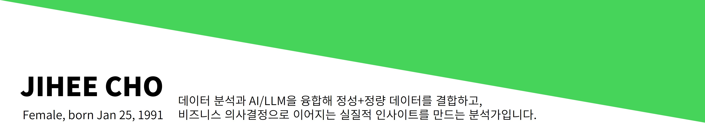

## 👋 Hi There!

  

<h2 align="center">🔑 핵심역량</h2>

🌐 정성+정량 데이터 융합 &nbsp;|&nbsp; 🧠 Bayesian 모델링·대시보드 구축 &nbsp;|&nbsp; 🤖 AI/LLM 응용  
 
📊 비즈니스 인사이트 연결 &nbsp;|&nbsp; 🤝 글로벌 협업 경험 &nbsp;|&nbsp; 📝 프롬프트 엔지니어링

---

<h2 align="center">🛠 기술스킬</h2>

  
  
  
  
  
  
  
  

---
<h2 align="center">📌 프로젝트 하이라이트</h2>

---

### 🤖 AI/LLM 기반 분석 챗봇
SOLAR(huggingface) + QLoRA 적용, **개인 말투 챗봇 개발**

  
  

---
### 🌐  Bayesian 모델링 & 대시보드 
소셜 데이터 + 조사 데이터 결합, **디지털 트윈 기반 인사이트 및 대시보드 구축**

  
  

---
### 📈 Bayesian norm & 디지털 트원
온라인 리뷰 크롤링을 통한 Segment별 디지털 트윈 데이터 생성 + Bayesian으로 정성데이터+정량데이터 결합을 통한 형용사 평가 norm 구축

  
  
  

---

### 📊 수요 예측
다양한 지표를 활용하여 향후 가전시장 수요, Brand Mind Share% 예측 정확도 제고

  
  

---

### 👥 브랜드 파워 영향 요인 분석
LPA를 통한 합성 지표+SEM 기반 **성과 Path 분석 & 전략 제안**

  
  

---

### 🔢 기타 업무 포트폴리오
업무 자동화 및 데이터 검증 툴

  

